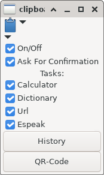

# ClipboardManager

* [VERSION 4.2.230117](https://github.com/carlosjhr64/clipboard_manager/releases)
* [github](https://github.com/carlosjhr64/clipboard_manager)
* [rubygems](https://rubygems.org/gems/clipboard_manager)

## DESCRIPTION:

Ruby Gtk3App Clipboard Manager.

## SCREENSHOT:



## FEATURES

* eval-calculator
* Wiktionary
* xdg-open url
* espeak

Also:

* History
* QR-Code copy to clipboard

## INSTALL:
```shell
$ gem install clipboard_manager
```
## MOUSE CLICKS ON LOGO:

+ Button #1: Toggle Minime
+ Button #2: Toggle On/Off
+ Button #3: Pop-up Application Menu

## CONFIGURATION:

After an initial run, your user configuration will found in:

    ~/.config/gtk3app/clipboardmanager/config-?.?.rbon

At top of the file you will find the available tasks:
```ruby
{
  Tasks!: {
    calculator: [
      "^([\\d\\.\\+\\-\\*\\/\\%\\(\\) ]{3,80})$",
      :reply,
      true
    ],
    dictionary: [
      "^(\\w+)$",
      :bashit,
      true,
      "xdg-open 'https://en.wiktionary.org/wiki/$1'"
    ],
    url: [
      "^https?://\\w[\\-\\+\\.\\w]*(\\.\\w+)(:\\d+)?(/\\S*)?$",
      :open,
      true
    ],
    espeak: [
      ".{40,}",
      :espeak,
      true
    ]
  },
  # ...
}
```
It is by this configuration that one can modify and add tasks.
Note that this is an [RBON](https://rubygems.org/gems/rbon) file.
ClipboardManager has four tasks methods:

* `:bashit` will take a command to be run by the system.
* `:open` will `xdg-open` the clip.
* `:espeak` will `espeak` the clip.
* `:reply` will `eval` the clip and display a message with the result.

With the boolean `true` value the clipboard will clear on the matched task.
If you don't want the clipboard cleared on a matched task,
set the boolean value to `false`.

Note that `:bashit` requires a extra command string which
it will substitute $0, $1, $2... with match data.
It then passes the string to system.

The `:caculator` task will run when the clip looks like a bunch of number being operated.

The `:espeak` task will run when the clip is at least 80 characters long.
It will have espeak read the text.

## HELP:
```console
$ clipboard_manager --help
Usage:
  clipboard_manager [:options+]
Options:
  -h --help
  -v --version
  --minime      	 Real minime
  --notoggle    	 Minime wont toggle decorated and keep above
  --notdecorated	 Dont decorate window
```
## LICENSE:

(The MIT License)

Copyright (c) 2023 CarlosJHR64

Permission is hereby granted, free of charge, to any person obtaining
a copy of this software and associated documentation files (the
'Software'), to deal in the Software without restriction, including
without limitation the rights to use, copy, modify, merge, publish,
distribute, sublicense, and/or sell copies of the Software, and to
permit persons to whom the Software is furnished to do so, subject to
the following conditions:

The above copyright notice and this permission notice shall be
included in all copies or substantial portions of the Software.

THE SOFTWARE IS PROVIDED 'AS IS', WITHOUT WARRANTY OF ANY KIND,
EXPRESS OR IMPLIED, INCLUDING BUT NOT LIMITED TO THE WARRANTIES OF
MERCHANTABILITY, FITNESS FOR A PARTICULAR PURPOSE AND NONINFRINGEMENT.
IN NO EVENT SHALL THE AUTHORS OR COPYRIGHT HOLDERS BE LIABLE FOR ANY
CLAIM, DAMAGES OR OTHER LIABILITY, WHETHER IN AN ACTION OF CONTRACT,
TORT OR OTHERWISE, ARISING FROM, OUT OF OR IN CONNECTION WITH THE
SOFTWARE OR THE USE OR OTHER DEALINGS IN THE SOFTWARE.
